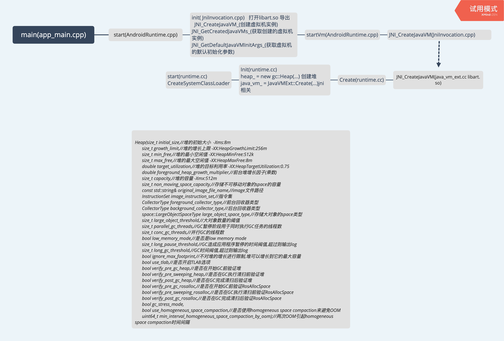

# FrameworkLeaning
### 编译系统([编译前准备](https://juejin.im/post/5da29dc9f265da5b633cdc8e))
0. [MacOSX10.11.sdk.tar.xz](MacOSX10.11.sdk.tar.xz)解压放到/Applications/XCode.app/Contents/Developer/Platforms/MacOSX.platform/Developer/SDKs/,前提安装xcode
1. 在 Mac OS 中，可同时打开的文件描述符的默认数量上限太低，在高度并行的编译流程中，可能会超出此上限。要提高此上限，请将下列行添加到 ~/.bash_profile 中：
ulimit -S -n 1024
2. $ source build/envsetup.sh(使用envsetup.sh脚本初始化环境)
3. $ lunch 
- user:设定属性ro.secure=1,打开安全检查功能 \ 设定属性ro.debuggable=0,关闭应用调试功能 \ 默认关闭adb功能 \ 打开Proguard混淆器 \ 打开DEXPREOPT预先编译优化	
- userdebug:设定属性ro.secure=1,打开安全检查功能 \ 设定属性ro.debuggable=1,启用应用调试功能 \ 默认打开adb功能 \ 打开Proguard混淆器 \ 打开DEXPREOPT预先编译优化	
- eng:设定属性ro.secure=0,关闭安全检查功能 \ 设定属性ro.debuggable=1,启用应用调试功能 \ 默认打开adb功能 \ 关闭Proguard混淆器 \ 关闭DEXPREOPT预先编译优化	\ 设定属性ro.kernel.android.checkjni=1,启用JNI调用检查

4. $ sysctl -n machdep.cpu.core_count(查看内核数)
5. $ make -j4（4来自3的数量）

### ps 最终编译成功的流程
1. repo sync 可以执行多次保证源码的完整性
2. source build/envsetup.sh
3. lunch
4. make clobber
5. make SELINUX_IGNORE_NEVERALLOWS=true 代替make -j4 用后者试了5、6次都是编译60%多（2、3个小时候后）报错,几乎放弃
- 常见的一些make编译命令如下所示：
- make 编译工程与模块    //编译整个工程，整体编译时间较长
- make module              //对单个模块进行编译，对其所依赖的模块也进行编译，整体编译时间较长
- mm                              //先进入子目录，对其目录对应的模块进行编译，编译时间短
- mmm                           //编译制定目录下的模块，不编译其所依赖的其他模块，第一次一般都会报错，编译时间短
- make生成镜像文件
- make bootimage        //生成boot.img文件
- make snod                  //重新打包生成system.img文件
- make userdataimage //生成userdata.img文件
- make 无参数               //编译所有的工程

### 生成debug相关文件
1. source build/ensetup.sh  
2. make idegen
3. development/tools/idegen/idegen.sh

## logic
 